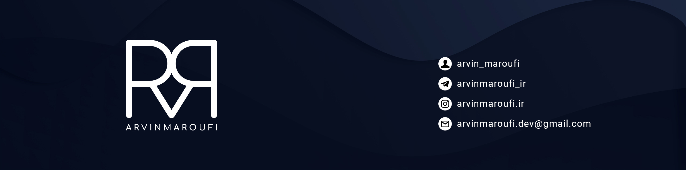

  

#

# 💫 About Me:
💻 Backend Developer (Python, Django) 💙 Python teacher

## 🌐 Socials:

# 💻 Tech Stack:
        
# 📊 GitHub Stats:
 
 

<!-- Proudly created with GPRM ( https://gprm.itsvg.in ) -->
