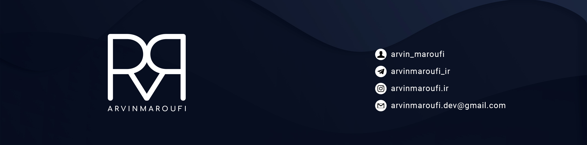

  

 

  
  
  

## 💫 About Me
👨‍💻 Senior Back-End Engineer (Python/Django) | Instructor & Mentor 
🚀 5+ years architecting and delivering sophisticated Django-powered platforms. 
📚 Sharing expertise as an instructor, shaping the skills of aspiring Python/Django devs. 
🎯 Focused on clean architecture, performance optimization, and best practices. 
🔧 Tech Stack: Python, Django, Django REST Framework, 
JavaScript, PostgreSQL & .... 
🌱 Continuously evolving my craft and exploring new paradigms in backend development.

 

## 🏆 Trophies

 

## 🌐 Socials

 

## ⚙️ Skills & Tools

### 💻 Languages & Markup

### 🚀 Frameworks & Libraries

### 💾 Databases

### ⚒️ Development Tools

 

## 🌟 Soft Skills
<table>
  <thead>
    <tr>
      <th>Problem Solving</th>
      <th>Team Collaboration</th>
      <th>Mentoring</th>
      <th>Communication</th>
      <th>Attention to Detail</th>
      <th>Eagerness to Learn</th>
    </tr>
  </thead>
  <tbody>
    <tr align="center">
      <td>✔️</td>
      <td>✔️</td>
      <td>✔️</td>
      <td>✔️</td>
      <td>✔️</td>
      <td>✔️</td>
    </tr>
  </tbody>
</table>

 

---

## 🚀 Featured Projects

### 🎬 Moplay - Advanced Movie & Series Streaming Platform

A comprehensive streaming platform built with Django, offering thousands of movies, series, and related articles for Persian-speaking users. Features include advanced filtering, user dashboard, subscription plans, wallet system, and complete content management.

**Tech Stack:** Django, SQLite, HTLM5, CSS3, JavaScript  
**Role:** Full-Stack Developer & Architect  
🔗 **[View on GitHub →](https://github.com/arvinmaroufi/Moplay)**

---

### 🛍️ MasaiShop - Professional E-Commerce Platform

A complete online shopping experience with advanced product filtering, brand and category management, discount systems, shopping cart, order tracking, wishlist, and comprehensive user dashboard. Built with a focus on user experience and performance.

**Tech Stack:** Django, SQLite, HTLM5, CSS3, JavaScript  
**Role:** Full-Stack Developer & Architect  
🔗 **[View on GitHub →](https://github.com/arvinmaroufi/MasaiShop)**

---

### 🎟️ TicketSystem - Advanced Ticket Management System

A robust ticketing system for managing user requests and support tickets. Features include ticket creation, file attachments, real-time messaging, admin dashboard with user management, and notifications.

**Tech Stack:** Django, SQLite, HTLM5, CSS3, JavaScript  
**Role:** Full-Stack Developer & Architect  
🔗 **[View on GitHub →](https://github.com/arvinmaroufi/TicketSystem)**

---

### 🎬 ApplayMovie - Free Movie & Series Download Website

A user-friendly platform for downloading movies and series for free. Features include genre-based filtering, comments system, actor/director profiles, and article management.

**Tech Stack:** Django, SQLite, HTLM5, CSS3, JavaScript  
**Role:** Full-Stack Developer & Architect  
🔗 **[View on GitHub →](https://github.com/arvinmaroufi/ApplayMovie)**

---

### 📧 EmailAuth - Professional Authentication System

A complete and secure authentication system with email-based login, password reset functionality, OTP verification, and user profile management. Perfect for developers looking to implement robust authentication in their projects.

**Tech Stack:** Django, SQLite, HTLM5, CSS3, JavaScript  
**Role:** Full-Stack Developer & Architect  
🔗 **[View on GitHub →](https://github.com/arvinmaroufi/EmailAuth)**

---

### 📰 WorldNews - Modern News Portal

A dynamic news platform with category and tag management, admin panel, load-more functionality, newsletter system, and complete user authentication. Built for content publishers and news aggregators.

**Tech Stack:** Django, SQLite, HTLM5, CSS3, JavaScript  
**Role:** Full-Stack Developer & Architect  
🔗 **[View on GitHub →](https://github.com/arvinmaroufi/WorldNews)**

---

### 🖥️ Vira - Network Equipment & Server Hardware Store

A specialized e-commerce platform focused on network components, server hardware, and IT infrastructure solutions. Features include advanced product categorization, inventory management, quote system, B2B pricing, and complete order management. Designed for businesses and IT professionals requiring reliable hardware solutions.

**Tech Stack:** Django, PostgreSQL, HTLM5, CSS3, JavaScript 

**Role:** Lead Back-End Developer & System Architect  

**Private Repository**

---

## 👨‍🏫 Teaching & Mentoring Experience

I'm passionate about sharing knowledge and have extensive experience in teaching Python and Django development:

- **Python Programming** – From fundamentals to advanced concepts including OOP, decorators, generators, context managers, and functional programming
- **Django Framework** – Complete web development including models, views, templates, forms, authentication, REST APIs, and deployment
- **Django REST Framework** – Building robust RESTful APIs, authentication, permissions, serializers, and API documentation
- **Back-End Architecture** – Clean architecture, design patterns, performance optimization, and best practices
- **Mentoring** – Guiding junior developers through real-world projects, code reviews, and career development

🎯 **Teaching Approach:** Practical, project-based learning with real-world examples and industry best practices.

---

## 📌 Project Overview

| Project | Domain | Key Features |
|---------|--------|--------------|
| Moplay | Streaming | Video streaming, subscriptions, wallet |
| MasaiShop | E-Commerce | Full shopping experience, discounts |
| TicketSystem | Support | Ticketing, messaging, admin panel |
| ApplayMovie | Entertainment | Free downloads, comments |
| EmailAuth | Authentication | Secure auth, OTP, password reset |
| WorldNews | Publishing | News management, admin dashboard |
| Vira | B2B E-Commerce | Network hardware, inventory, B2B pricing |

---

**💡 All public projects are production-ready, well-documented, and follow Django best practices. Feel free to explore, fork, and contribute!**

 

## 🗣️ Languages
- **Kurdish**: Native
- **Persian**: Conversational
- **English**: B1 (Improving)
- **German**: A2 (Improving)

 

## 💬 Contact Me

 

## 📊 GitHub Stats

 
 
 

